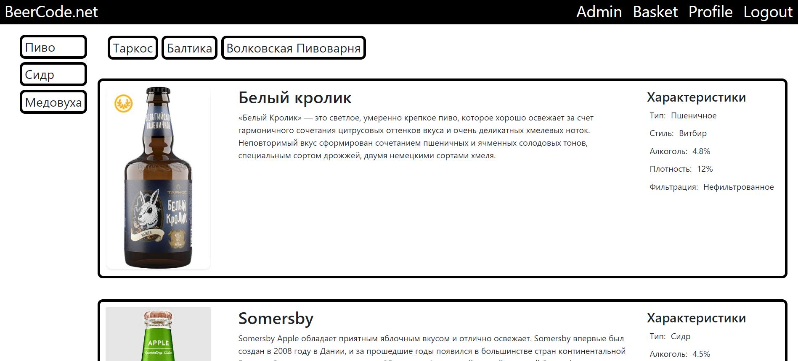
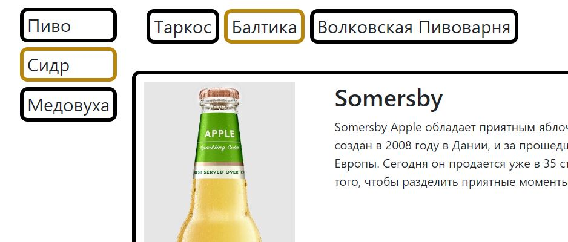
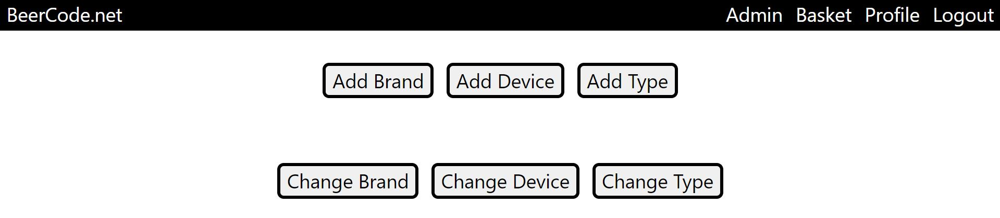
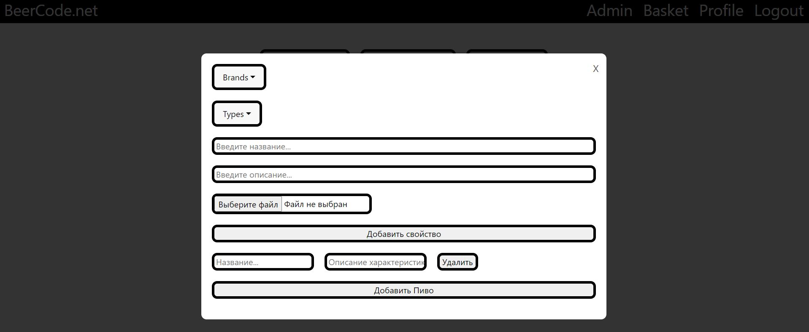
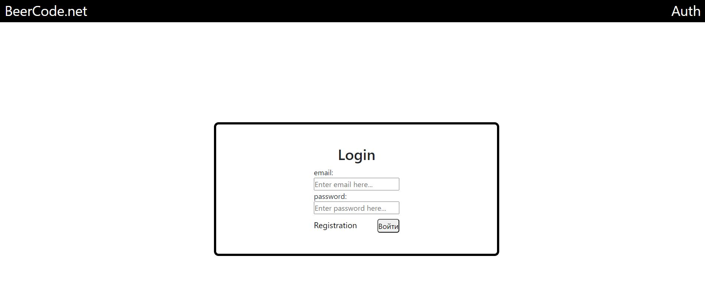

# BeerCode.net

## Описание:

Проект создается для сети розничных магазинов в которой реализуется продажа слабоалкогольных напитков(пиво/сидр/медовуха и пр.).
Основной целью стоит создание БД имеющая полное описание того или иного напитка включая его характеристики, описание, изображение, и самое главное QR-Code со ссылкой на сайт на котором предсставлена информация о данном напитке со всеми вышеописанными характеристиками.

---

## Оглавление:

- Технологии
- Основные страницы
- Карта развития
- API
- Структура проекта

---

## Технологии:

---

## Основные страницы:

### Главная страница:

Главная страница представляет из себя ветрину с пагинацией и активными кнопками с помощью которых можно можно выбирать определенный вид напитка и его производителя

### Страница Администратора:

Страница администратора представлена в виде набора кнопок с модальными окнами через которые можно управлять добавлением/изменением существующих напитков/их видов/производителей

### Страница логина/регистрации:

На данном этапе реализована базовая версия входа/регистрации с хэшированием пороля. В дальнейшем планируется добавить аутентификацию через Google/Facebook/Vk и пр.

---

## Карта развития:

1. :white_large_square: Сделать мобильную версию сайта
2. :white_large_square: Улучшить визуальную составляющую сайта
3. :white_large_square: Сделать современную форму решистрации через Google и соцсети
4. :white_large_square: Создать раздел Избранное(basket)
5. :white_large_square: Создать систему отзывов
6. :white_large_square: Создать профиль пользователя с отображением его предпочтений/отзывов оставленных на сайте

---
